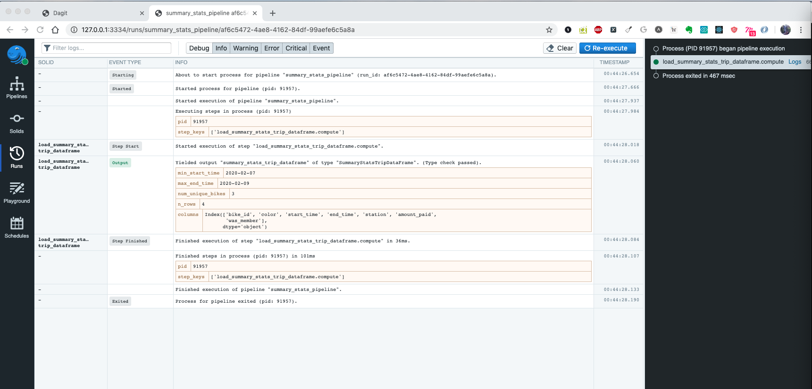

# Dagster Pandas Guide

## Using Pandas DataFrames in Dagster

Many data pipelines constantly perform computations on dataframes using pandas. As a result, 
dagster provides a simple integration along with a host of useful features that come right out of the box. 
To use pandas dataframes as the input/outputs in your solids, simply do the following:

```python
from dagster import solid
from dagster_pandas.data_frame import DataFrame


@solid
def transform_dataframe(_, input_dataframe: DataFrame) -> DataFrame:
    output_dataframe = input_dataframe
    # Perform transformations on output_dataframe
    return output_dataframe
```

The out of the box DataFrame type uses a simple `type_check` that checks if the object is an 
instance of a pandas DataFrame and also emits simple summary statistics like the number of rows 
and the column names.

## Creating custom dataframe types in dagster

The above example provides a simple introduction to using dataframe types in dagster solids. However, the dagster type 
system can be extended to support a ton of validation needs your pipelines can easily utilize in order to be more 
robust to data changes and transformation errors. Our dagster-pandas integration provides an API for creating custom 
dataframe types that perform schema validation, data quality checks, emit summary statistics, and enable safe/reliable 
IO for dataframe serialization/deserialization.

To create a custom dagster pandas type, use `create_dagster_pandas_dataframe_type`. Aside from optional 
`name` and `description` fields for documentation in dagit, you can provide a summary statistics function that emits 
`EventMetadataEntry` objects. To further illustrate this idea, take a look at the next example which creates a custom 
dagster dataframe that details e-bike trips. Given this, we can construct our dagster pandas type and hook it into 
our solids in the following way:

```python
from dagster import EventMetadataEntry, solid, OutputDefinition, pipeline

from dagster_pandas import create_dagster_pandas_dataframe_type
from pandas import DataFrame
from datetime import datetime


def compute_trip_dataframe_summary_statistics(dataframe):
    return [
        EventMetadataEntry.text(
            datetime.fromtimestamp(min(dataframe['start_time'])).strftime('%Y-%m-%d'), 
            'min_start_time', 
            'Date data collection started',
        ),
        EventMetadataEntry.text(
            datetime.fromtimestamp(max(dataframe['end_time'])).strftime('%Y-%m-%d'), 
            'max_end_time', 
            'Date data collection ended'
        ),
        EventMetadataEntry.text(
            str(len(dataframe)), 'n_rows', 'Number of rows seen in the dataframe'
        ),
        EventMetadataEntry.text(
            str(dataframe.columns), 'columns', 'Keys of columns seen in the dataframe'
        ),
    ]


TripDataFrame = create_dagster_pandas_dataframe_type(
    name='TripDataFrame',
    event_metadata_fn=compute_trip_dataframe_summary_statistics
)


@solid(
    output_defs=[OutputDefinition(name='trip_dataframe', dagster_type=TripDataFrame)],
)
def load_trip_dataframe(_) -> DataFrame:
    return DataFrame({
        'start_time': [1580926118, 1580929718, 1580933318, 1580936918],
        'end_time': [1580933318, 1580936918, 1580940518, 1580944118]
    })


@pipeline
def trip_pipeline():
    load_trip_dataframe()
```

If you execute this pipeline in the dagit playground, you should get the following:

 

Notice the summary statistics being surfaced as your pipeline executes. Since data systems can seldom control the
quality of the data they receive, it becomes really important to monitor data as it flows through your systems.
In complex pipelines, this can really help debug and monitor data drift over time.


## Dagster Dataframe Level Validation

Now that we have a custom dataframe type that emits summary statistics during a pipeline run, we can start to 
express dataframe level shape constraints (e.g number of rows, or columns). 

You can do this by providing a list of dataframe constraints to `create_dagster_pandas_dataframe_type`. These
constraint objects live in `dagster_pandas/constraints.py`. Two such constraints are 
the `RowCountConstraint` and `StrictColumnsConstraint`.  

Let's extend the example above to illustrate this:

```python
from dagster_pandas import create_dagster_pandas_dataframe_type, RowCountConstraint, StrictColumnsConstraint


TripDataFrame = create_dagster_pandas_dataframe_type(
    name='TripDataFrame',
    event_metadata_fn=compute_trip_dataframe_summary_statistics,
    dataframe_constraints=[
        RowCountConstraint(4),
        StrictColumnsConstraint(['start_time', 'end_time'])
    ]
)
```

So if we rerun the above example with this dataframe, nothing should change. However, if you pass in 100 to the row
count constraint, you can watch your pipeline fail that type check.


The `PandasColumn` is an API that lets you express the columns your dataframes expect. However, this wouldn't be much
of a library if we didn't support further validation, the most obvious being type validation. To do this, 
the `PandasColumn` takes a list of constraints. Let's say that a `bike_id` was a integer, and `start_time`/`end_time` 
were datetimes. It is then possible to construct the following schema for the `TripDataFrame` dataframe.

```python
from dagster_pandas import PandasColumn, create_dagster_pandas_dataframe_type
from dagster_pandas.constraints import ColumnTypeConstraint


TripDataFrame = create_dagster_pandas_dataframe_type(
    name='TripDataFrame',
    columns=[
        PandasColumn('bike_id', constraints=[ColumnTypeConstraint('int64')]),
        PandasColumn('start_time', constraints=[ColumnTypeConstraint('datetime64[ns]')]),
        PandasColumn('end_time', constraints=[ColumnTypeConstraint('datetime64[ns]')]),
    ],
    event_metadata_fn=compute_trip_dataframe_summary_statistics
)
```

It is possible to add many constraints to your list to get a bunch of validation for your columns. However, 
there will inevitably be cases where you want some bespoke validation. To do this, simply create a constraint
that adheres to the `ColumnConstraint` interface and insert it into the `constraints` list for your 
`PandasColumn`. 

Let's reimplement `CategoricalColumnConstraint`. To do this, all it needs is a `markdown_description` 
for dagit which accepts and renders markdown syntax, a `error_description` 
for error logs, and a validation method which throws a `ColumnConstraintViolationException` if 
a row fails validation. This would look like the following:

```python
from dagster_pandas.constraints import ColumnConstraint, ColumnConstraintViolationException

class CategoricalColumnConstraint(ColumnConstraint):
    def __init__(self, categories):
        self.categories = categories
        super(CategoricalColumnConstraint, self).__init__(
            error_description="Expected Categories are {}".format(self.categories),
            markdown_description="Category examples are {}...".format(self.categories[:5]),
        )

    def validate(self, dataframe, column_name):
        rows_with_unexpected_buckets = dataframe[~dataframe[column_name].isin(self.categories)]
        if not rows_with_unexpected_buckets.empty:
            raise ColumnConstraintViolationException(
                constraint_name=self.name,
                constraint_description=self.error_description,
                column_name=column_name,
                offending_rows=rows_with_unexpected_buckets,
            )
```

By now you are noticing that this is all quite verbose. To ameliorate this, the `PandasColumn` class defines a 
higher level API for common use cases. Let's go back to the `TripDataFrame`, it can also be expressed in the following
way:

```python
from dagster_pandas import PandasColumn, create_dagster_pandas_dataframe_type

from pandas import Timestamp


TripDataFrame = create_dagster_pandas_dataframe_type(
    name='TripDataFrame',
    columns=[
        PandasColumn.integer_column('bike_id', min_value=0),
        PandasColumn.datetime_column('start_time', min_datetime=Timestamp(year=2018, month=1, day=1)),
        PandasColumn.datetime_column('end_time', min_datetime=Timestamp(year=2018, month=1, day=1)),
    ],
    event_metadata_fn=compute_trip_dataframe_summary_statistics
)
```

These are just convenience methods that compose the right PandasColumns for you for the most common use cases. Feel free
to explore them in the `PandasColumn` class to see all of the different convenience functions available to you.

By now a lot of the validation described has been column based. It is also possible to have dataframe constraints like
row count or strict column ordering. To do this simply provide a list of `DataFrameConstraint` type objects to
`create_dagster_pandas_dataframe_type` in the following way:

```python
from dagster_pandas import PandasColumn, create_dagster_pandas_dataframe_type, RowCountConstraint

from pandas import Timestamp


TripDataFrame = create_dagster_pandas_dataframe_type(
    name='TripDataFrame',
    columns=[
        PandasColumn.integer_column('bike_id', min_value=0),
        PandasColumn.datetime_column('start_time', min_datetime=Timestamp(year=2018, month=1, day=1)),
        PandasColumn.datetime_column('end_time', min_datetime=Timestamp(year=2018, month=1, day=1)),
    ],
    dataframe_constraints=[RowCountConstraint(2000)],
    event_metadata_fn=compute_trip_dataframe_summary_statistics
)
```

Finally, now that we have explored all of the different ways to compose custom dagster pandas dataframes. 
It is possible to plug them into solids via Input/Output Definitions as follows:

```python
import pandas as pd

from dagster import InputDefinition, OutputDefinition, pipeline, solid

from dagster_pandas import DataFrame


@solid(
    input_defs=[InputDefinition(name='dataframe', dagster_type=DataFrame)],
    output_defs=[OutputDefinition(name='trip_dataframe', dagster_type=TripDataFrame)],
)
def preprocess_trip_dataset(_, dataframe: DataFrame) -> DataFrame:
    dataframe = dataframe[['bike_id', 'start_time', 'end_time']].dropna(how='all').reindex()
    dataframe['bike_id'] = dataframe['bike_id'].astype('int64')
    dataframe['start_time'] = pd.to_datetime(dataframe['start_time'])
    dataframe['end_time'] = pd.to_datetime(dataframe['end_time'])
    return dataframe


@solid
def download_trip_dataframe(_) -> DataFrame:
    return pd.DataFrame({
        'bike_id': [1, 2, 3],
        'start_time': [pd.Timestamp(year=2018, month=2, day=3) for _ in range(3)],
        'end_time': [pd.Timestamp(year=2018, month=2, day=4) for _ in range(3)]
    })


@pipeline
def trip_pipeline():
    preprocess_trip_dataset(download_trip_dataframe())
```  

After executing the above pipeline in dagit, it will show the following:


Not only is there columnar validation but there are also metadata summaries of your data as it flows
through your pipeline. Moreover, the dagit solid explorer shows useful markdown documentation about your dataframes
(Hence the need for differentiation between `error_description` and `markdown_description` in `ColumnConstraints`).

 

Hopefully this gives a decent picture of how dataframes ought to be used in dagster and the syntactic sugar
available to maximize workflow development.